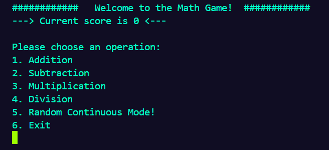

#### A simple game where the user is presented with a math expression and has to write the right answer!
Made to learn C# and .NET :) Following The C# Academy project ideas: https://www.thecsharpacademy.com/project/53/math-game

Currently only an IDE terminal game. 

#
#### To Do:
- Add GUI - to learn more about GUI options in C# and .NET.
- Add hard mode - maybe? 
